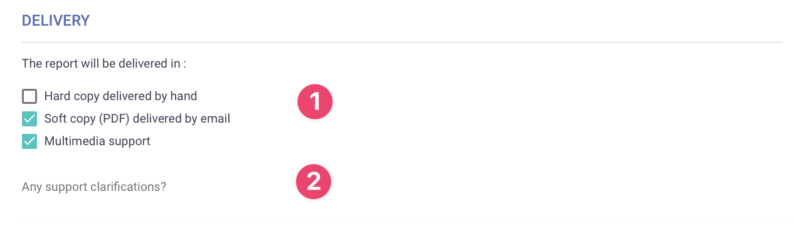
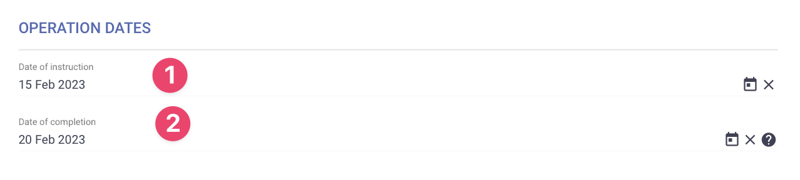
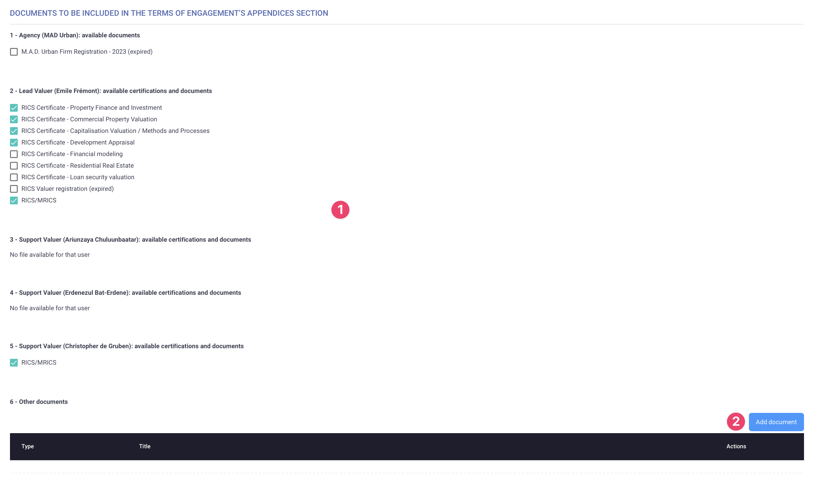

# Delivery Details

This tab is where you define how and when the valuation report will be handled and specify which documents will be included in the terms of engagement.

## 1 - Delivery

<figure><figcaption>
Report Delivery
</figcaption></figure>

1. **Report Delivery Method:** Choose how the reports will be handled to the client. Options include hard copy delivered by hand, soft copy (PDF) delivered by email, and multimedia support.
2. **Support Clarifications:** Specify any important details regarding the delivery of documents.\
   &#xNAN;_<mark style="color:orange;">**Example:**</mark> <mark style="color:orange;"></mark><mark style="color:orange;">If the report is to be delivered by hand, indicate the preferred time and location.</mark>_

## 2 - Operation dates

<figure><figcaption>
Operation Dates
</figcaption></figure>

1. **Date of Instruction:** Enter the date on which the terms of engagement are signed.
2. **Date of Completion:** Enter the date by which the full assignment should be finished and handed to the client.

## 3 - Documents to be included in the T0E

<figure><figcaption>
Documents to be included in Terms of Engagement
</figcaption></figure>

1. **List of Available Documents:** A list of documents available for either the valuer, their team, or the agency. These documents can be uploaded in the profile pages of each of these stakeholders.
2. **Add Document:** If needed, additional documents can be uploaded here.
