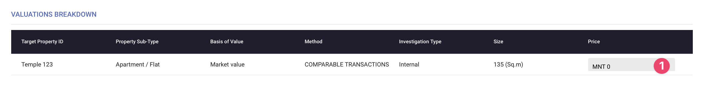
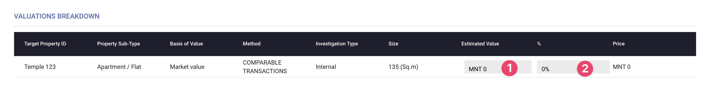
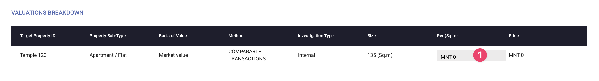
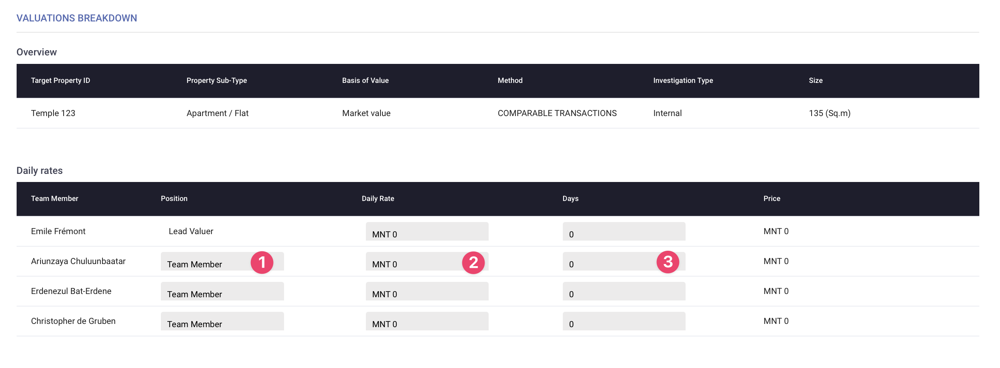
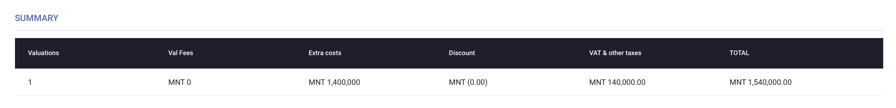

# Payment

This tab assists the valuer in accurately costing all aspects of the valuation. It supports various pricing schemes and ensures that every detail that could be invoiced is accounted for, including payment terms. Upon validating the Quote, the system will generate it automatically.

## 1 - General Information

<figure><figcaption>
General Information
</figcaption></figure>

1. **Currency** - Choose the currency you will use for costing everything.
2. **Discount**: Enter a discount if necessary.
3. **VAT**: Specify the VAT percentage.
4. **Other Taxes**: Indicate any other applicable taxes.
5. **Pricing Strategy**: Select from five pricing strategies (Lump sum, Percentage based, Size based, Daily rate for the company, Daily rate per team member).
6. **Number of Payment Terms**: Specify the number of payment terms.
7. **Payment Details**: Enter the percentage and date for each payment term.
8. **Post-Valuation Support**: Determine how to handle additional support required after delivering the reports. You can set a general policy in the agency form and override it here if needed.
9. **Hourly Rate**: Indicate how much you will charge per hour.
10. **Free Hours Included**: Specify the number of free hours included.
11. **Validity of Fees**: State how long these conditions will last.
12. **Work and Support**: Define the type of work and support included after delivering the reports.

## 2 - Valuation Breakdown

InterVal allows a wide range of pricing schemes for almost any case possible.

### A - Lumpsum payment

_Use this if you want to cost your valuation based on each property._

<figure><figcaption>
Lumpsum Payment
</figcaption></figure>

1. Enter the price for the property.

### B - Percentage based

Use this if you want to cost your valuation based on a percentage of a set estimated value for each property.

<figure><figcaption>
Percentage Based
</figcaption></figure>

1. **Estimated Value**: Enter the estimated value.
2. **Percentage**: Specify the percentage.

### C - Size based

Use this if you want to cost your valuation based on the size of each property.

<figure><figcaption>
Sise Based
</figcaption></figure>

1. **Price:** Price per Enter the price per square meter (or sq.ft if specified before).

### D - Daily rate (Company)

Use this if you want to cost your valuation based on the time spent by the agency on each property.

<figure><figcaption>
Daily Rate (Company)
</figcaption></figure>

1. **Daily Rate:** Enter the daily rate for the full team.
2. **Number of Days:** Specify the number of days.

### E - Daily rate (per team member)

Use this if you want to cost your valuation based on the time spent by each individual assigned to the task by the company.

<figure><figcaption>
Daily Rate (Team)
</figcaption></figure>

1. **Position**: Indicate the position.
2. **Daily Rate**: Enter the daily rate of the individual.
3. **Number of Days**: Specify the number of days.

## 3 - Additional Costs

Some options in the target property form (Due Diligence & Measurement Instruction) will automatically add a line to this table to ensure these costs are invoiced if necessary. Additional costs such as transportation, per diems, and accommodation can also be added here.

<figure><figcaption>
Additional Costs
</figcaption></figure>

1. **Title**: Edit the title of the cost.
2. **Target Property**: Specify if the cost is related to a single property or the entire Quote.
3. **Quantity**: Enter the quantity.
4. **Unit Price**: Enter the unit price.
5. **Actions**: Edit or delete each cost.

## 4 - Summary

This table provides a complete breakdown of the pricing details for this Quote. It will display the number of valuations, valuation fees, extra costs, discounts, VAT & other taxes, and the total cost.

<figure><figcaption>
Summary
</figcaption></figure>
