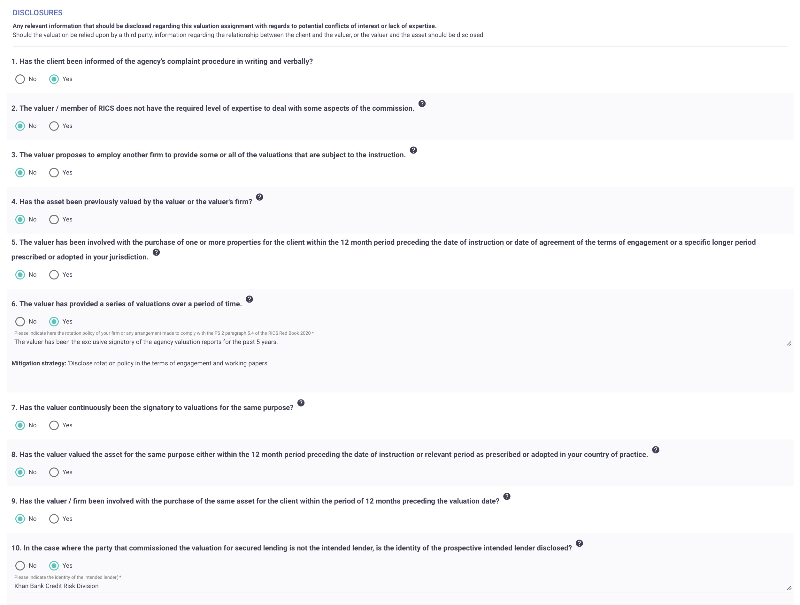

# Disclosures

Disclosures under RICS standards are essential to ensure transparency and maintain the integrity of the valuation process. These disclosures provide critical information that may influence the outcome of the valuation or affect the valuer's ability to continue with the assignment.

Some disclosures, such as conflicts of interest or lack of expertise, may prohibit the valuer from proceeding with the assignment. The page displays a comprehensive list of potential disclosures that need to be made.

Certain items on the list will only be displayed based on the information provided in the General tab or the Target Property form. This ensures that all relevant disclosures are considered and documented appropriately.

<figure><figcaption>
Disclosures List
</figcaption></figure>
