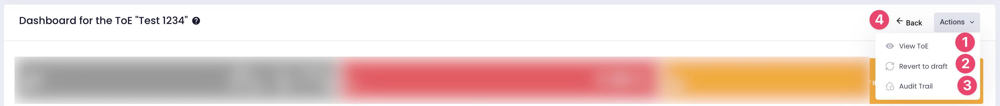

# Intro: Structure & Header

InterVal generates a dashboard for each Terms of Engagement (ToE). This is your control center to manage all aspects of the valuation assignment. The page is composed of four main parts: Header, Summary, Admin, and Valuation Tasks (one block per target property). Let's dive in to get a general understanding.

## 1 - Structure

<figure><figcaption>
the 4 main sections of the dashboard
</figcaption></figure>

1. [<mark style="color:blue;">**Header:**</mark>](intro-structure-and-header.md#id-2-header) Like any other page, the header provides the ability to exit this page or access various functionalities through the action menu. It ensures quick navigation and control over the current assignment.
2. [<mark style="color:blue;">**Summary:**</mark>](summary.md) This section includes a set of modules that give you a good overview of the assignment. The modules display key information such as the number of properties to be valued, the number of inspections required, the valuation purpose, completion status, deadlines, and team members. Each element is designed to provide at-a-glance updates on the assignment's status and essential details.
3. [**Admin Tasks:**](admin-tasks.md) This section contains all the administrative features related to the assignment, such as invoicing, amendments, payments, audit trails, and contracts. It provides a centralized place to manage all the admin tasks efficiently.
4. [**Valuation Tasks:**](valuation-module.md) For each target property, a module like this one will appear, allowing you to manage the valuation tasks and assign them. This section helps in tracking and completing all necessary tasks for the valuation, ensuring that each step is covered thoroughly.

## 2 - Header

The header provides access to a few functionalities such as canceling the current ToE, adding interactions to the audit trail, and viewing the ToE.

<figure><figcaption>
Header
</figcaption></figure>

1. **View ToE**: Brings you back to the ToE Form without editing capability.
2. **Revert to Draft**: Cancels the current assignment. Warning: this will cause you to lose all work done for this assignment. It brings you back to the ToE Form with editing capability.
3. **Audit Trail**: Provides a record of all interactions and modifications related to the ToE.
4. **Back Button**: Returns to the previous screen.
