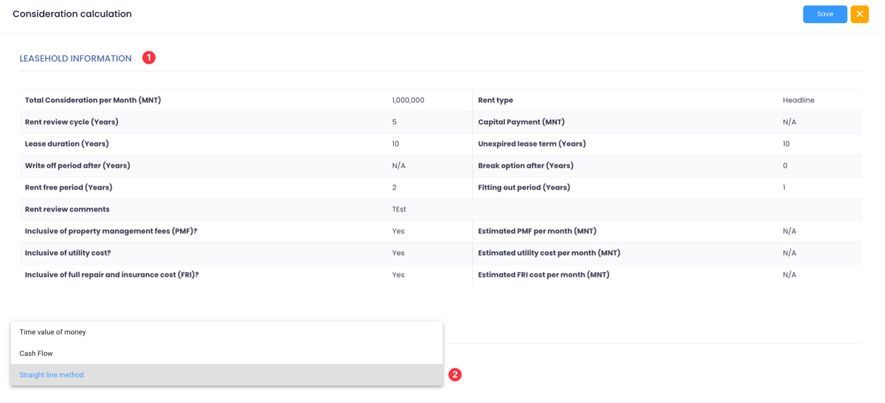

# Headline to Effective rent conversion

**Headline Rent (or “face rent”) is the actual contracted periodic rental payment under the lease, which becomes payable after all the initial incentives or concessions in the letting have ended. Effective Rent (or “equivalent rent”) is the rent that would be agreed between the parties for a letting of the premises on the relevant terms and conditions, but without incentives forming part of the transaction. Incentives may greatly impact a lease and the total quantum of income collected. To be able to compare apple to apple, this tool gives users the ability to arrive at the equivalent rent from a headline rent figure.**

There are three methods to do so in Interval, namely the straiht line, the Time value of money and the cash flow methods. The straight line method is a rapid conversion tool but does not consider the time value of money. The Time value of mony method does consider it, as the name implies, but does not capture rent reviews in long leases, while the cash flow method does that and is more adapted to longer leases with one more rent reviews.

<figure><figcaption>
Headline to Effective
</figcaption></figure>

1. Leashold information is displayed and shows the various terms of the lease, including its duration, rental amount, incentives and other fees (recoverable and non recoverable expenses)
2. Users can opt for one of the three methods to convert a headline rent to an effective one.

## 1 - Straight Line method

<figure><figcaption>
Straight Line Method
</figcaption></figure>

* The choice of the method is displayed (1) . The straight line mthod is best adapted to shorter lease terms where the time value of money impact is marginal.
* The module displays the period during which the rent is effectively received once incentives are over (after the rent free period) (2)
* All calculation steps are transparent with the methodology clearly explained (3)
* The capital value of inducements (the total rent received minus any capital payment made to the tenant) is spread over the total length of the lease minus the fitting out period, here not considered as an incentive but standard market practice (4);
* The Effective rent per year is given, inferior to the initial headline rent figure (5)

## 2 - Time Value of money method

<figure><figcaption></figcaption></figure>

There are three submethods to the The Value of Money method. Users can employ one capitalisation rate (as observed in the market), one investor oriented target rate, or a combination of the two. (1) When combined, the argument for two distinct rates is that incentives may be considered as the result of investor specific decisions to attract tenants, hence te use of a the target rate to capitalise the value of inducements.

<figure><figcaption></figcaption></figure>

* The capitalisation rate derived from market evidence can be inputted here (1), as well as the target rate. (2). When used together, both must be filled up by the user along with a justification for it.&#x20;
* The Year’s Purchase (YP) calculation uses the rent received period to derive a YP factor. (3)
* The Present Value calculation considers the rent free period (4) to derive the PV factor
* The Capital value of inducements is then calculated considering the previous elements and the headline rent per year. (5)
* To assess the total number of years deferred, the YP and PV over the total capitalisation period of the lease are used (6).
* The effective rent is then calculated by multiplying the headline rent per year by the deferred YP (7)

## 3 - Cash Flow method

<figure><figcaption>
Cashflow Method
</figcaption></figure>

The Cash Flow method is best suited to those leases with long tenure and one or sevral rent review events. It calculates the effective rent applicable for each of the terms (1) within the lease considering an assumed rental growth rate (2) that will be applied at each rent review. Just like the other mehods, it first assess the total capital value of inducements (3):

To derive the effective rent of each term, the module calculates the factor value of each term (a product of the YP and PV for each respective term):&#x20;

·      The factor value of the the first term uses inputs until the first rent review (4);&#x20;

·      The second term factor value applies rental growth to the reversionnary rent (5);&#x20;

·      The total factor value figure is arrived at by multiplying the 1st and 2nd terms values (6);

·      The Effective rent of the 1st term (7) and 2nd term (8) are assessed taking into account the total capitl value of inducements over the duration of the lease and assumed rental growth.
