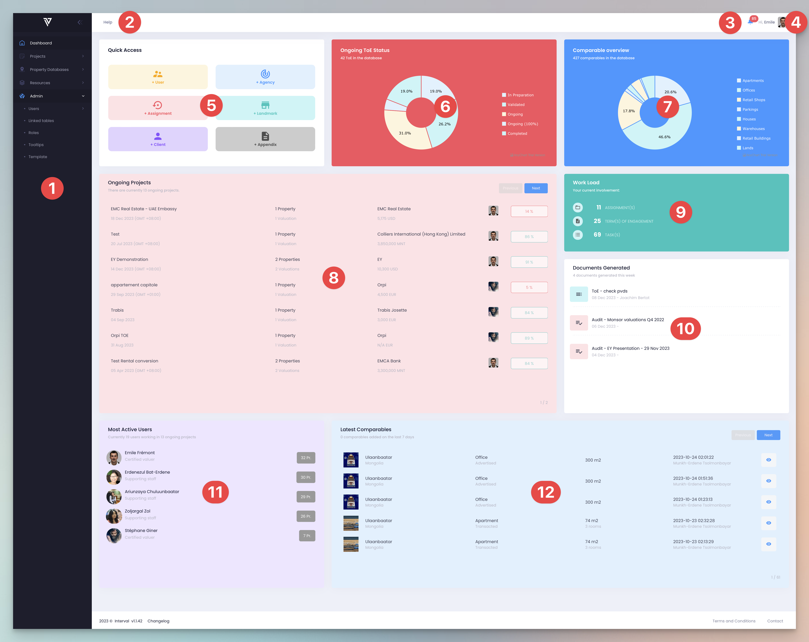

# Dashboard & Navigation

The Dashboard in InterVal provides a centralized hub for managing your valuation projects. It offers quick access to essential tools and updates, ensuring you can start your work efficiently and keep track of ongoing tasks. This section will guide you through the various elements of the Dashboard, helping you navigate and utilize InterVal's features effectively.

<figure><figcaption>
Dashboard (Screenshot)
</figcaption></figure>

## 1 - Navigation

<figure><figcaption>
Navigation menu (animated)
</figcaption></figure>

The black Navigation Menu that runs up and down the left hand side of the screen allows you to quickly access all of InterVal’s main features. The menu can be minimized or expanded by clicking on the double arrow icon at the top. The Navigation Menu  organized in a simple, hierarchical fashion, with sections and subsections that you can expand or collapse. You will find icons and links for the ‘Projects’, ‘Property Databases’, ‘Resources’, and ‘Admin’ sections on this menu. Clicking on any of these icons will expand the menu and reveal the relevant subsections, allowing for quick navigation to whatever you are looking for. The Navigation menu is always on the screen, making it easy to move around InterVal without getting lost or having to click a back or refresh button.

## 2 - Help Menu

<figure><figcaption>
Help menu (animated)
</figcaption></figure>

The 'Help' icon, in gray text at the top left side of the dashboard page, is your go-to for all types of assistance. It offers quick links to support, our user Knowledge Base, relevant FAQs, and direct chatline for further help. Click here for guidance and support whenever needed.

## 3 - Notifications

<figure><figcaption>
Notifications (animated)
</figcaption></figure>

The notification center, the bell icon at the top, right hand side of the dashboard, signals new activity. The icon is marked with red badge if there are any new notification. A number appears inside the red badge indicating how many notifications and new alerts require your attention.&#x20;

Click on this icon to view updates, reminders, and alerts tied to your work, such as fresh data entries or task progression.

## 4 - Profile Access

<figure><figcaption>
Profile (animated)
</figcaption></figure>

This module provides access to details on your user profile. It displays a welcoming message, such as "Hi, Emile," along with an icon for user settings and a sign-out option. This feature offers a personalized experience and allows quick access to modify profile settings or to log out of the system.

## 5 - Quick Access

<figure><figcaption>
Quick access (Screenshot)
</figcaption></figure>

Designed for efficiency, this section allows users to navigate to the features of InterVal that they use most frequently with just one click. Each colorful tile represents a different feature of the platform, such as 'Assignment', 'Agency', and 'Client'. This provide a personalized, efficient and engaging experience.

## 6 - Ongoing ToE Status

<figure><figcaption>
Ongoing ToE Status (Screenshot)
</figcaption></figure>

The Ongoing ToE status pie chart offers a visual breakdown of the status of the various projects or Terms of Engagement (ToEs) in the user's system. This chart provides an overview of how far advanced each project is and categorizes all ToEs into different phases such as 'In Preparation', 'Waiting', and 'Ongoing', etc.

## 7 - Comparable Overview

<figure><figcaption>
Comparable overview (Screenshot)
</figcaption></figure>

This Comparable overview pie chart provides an overview of the number and various types of properties in the database - including Apartments, Offices, and Retail Spaces, etc.&#x20;

## 8 - Ongoing Projects

<figure><figcaption>
Ongoing projects (Screenshot)
</figcaption></figure>

The Ongoing project tab view provides a snapshot of all active projects, including a list of pertinent details such as 'project name', 'associated client', and 'completion status'. The tab helps users track their team's progress on all projects with a simple glance.

## 9 - Workload

<figure><figcaption>
Workload (Screenshot)
</figcaption></figure>

The Workload widget displays the user’s current workload, showing a breakdown of all tasks assigned to the user in a clear, easy-to-read format. This widget thus integrates project management directly into the dashboard.

## 10 - Documents Generated

<figure><figcaption>
Documents generated (Screenshot)
</figcaption></figure>

The Documents generated tab provides a list of recently created documents complete with timestamps. This tab offers users a historical view of their output, ensuring they can track their documentation efforts over time.

## 11 - Most Active Users

<figure><figcaption>
Most active users (Screenshot)
</figcaption></figure>

This leaderboard-style widget  promotes engagement by showcasing the most active users in the system, fostering a sense of community and friendly competition within the company.

## 12 - Latest Comparables

<figure><figcaption>
Latest comparables (Screenshot)
</figcaption></figure>

The Latest Comparable tab provides a summary of the comparable properties most recently added to the database. The summary list contains details like type, size, and the date added, serving as a quick update feed on new entries to the database.
