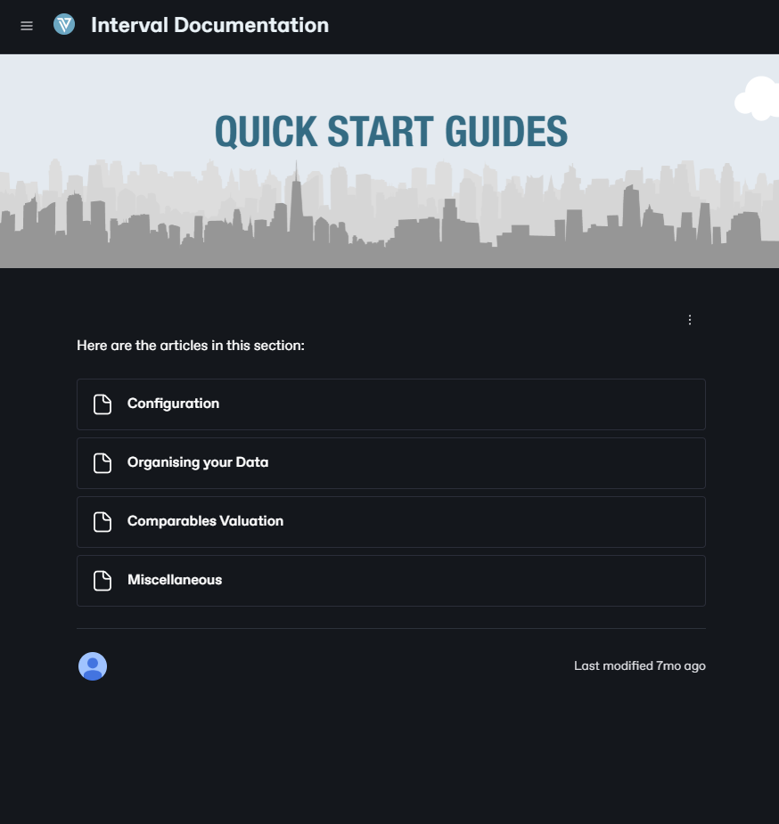

# Account Setup and Access

Welcome to InterVal, the revolutionary software package that is transforming the property valuation landscape. Designed to empower valuers, InterVal streamlines the real estate valuation process, improving efficiency, guaranteeing compliance, and delivering exceptional results.

&#x20;

**In this article, you will learn: a) how to create your InterVal account; b) how to log-in securely; and c) recover access to your account if you encounter any log-in issues.**

&#x20;

**This article is divided into two sections:**

1. **Creating Your Account:** This section presents a step-by-step guide to signing up for a new InterVal account.
2. **Logging In and Password Recovery:** This section presents instructions for accessing your account and resetting your password.

### **1 - Creating Your Account** 

#### Step A: Navigating to the Sign-Up Page 

To begin creating your InterVal account, start by visiting the InterVal website. Locate the **“Sign Up”** button on the top-right corner of the webpage, highlighted in red for visibility.

**In the screenshot provided:**

* The **red arrow** points to the “Sign Up” button on the website, ensuring users can easily identify the starting point for registration.
* Click on the **“Sign Up”** button to proceed to the registration form. This is where you will enter your details to create an account with InterVal.

<figure><figcaption></figcaption></figure>

#### Step B: Selecting a Plan 

After clicking the **“Sign Up”** button, you will be directed to the **Select Plan** page, where you can choose the subscription plan that best fits your needs.

**In the screenshot:**

1. **Billing Option Toggle**: Located at the top of the page (highlighted by arrow **1**), this toggle allows you to switch between **monthly** and **yearly** billing options. Choose your preferred payment schedule to view the corresponding pricing. There is a significant discount for those who pay for an annual plan in advance.
2. **Plan Options**:
   * **Essential Plan**:
     * **Monthly Billing**: Priced at **US$119 per user/month**.
     * **Yearly Billing**: Discounted to **US$1,188 per user/year** (equivalent to **US$99/month**).
     * This plan is designed for people who are new to InverVal. It allows Users to easily carry out the most common and important valuation tasks, build around the **Market** based approach and methodology.
   * **Standard Plan**:
     * **Monthly Billing**: Priced at **US$179 per user/month**.
     * **Yearly Billing**: Discounted to **US$1,788 per user/year** (equivalent to **US$149/month**).
     * This plan is tailored for valuation professionals and advanced Users, who require acces to advanced **Market** approaches as well as **Income (Capitalisation)** methodologies.

<figure><figcaption></figcaption></figure>

**Future Updates:**

* Starting **Q1 2025**, a new **Professional Plan** will be introduced. This plan will include advanced features, such as:
* Support for **Depreciated Replacement Cost** methodology.
* Integration of **Discounted Cash Flow (DCF)** analysis.
* Aimed at small teams or experienced valuers requiring sophisticated valuation tools.

**Choose the plan that best suits your current needs, or stay tuned for the launch of the Professional Plan in 2025. Click your desired option to proceed to the next step of the registration process.**

&#x20;

#### Step C: Completing the Sign-Up Form 

Once you’ve chosen your subscription plan, you’ll need to complete the **Sign-Up Form** by providing your details. Follow these steps:

1. **Plan Confirmation**: At the top, your selected plan (e.g., **Essential**) and payment frequency (**Billed monthly** or **Billed yearly**) are displayed for confirmation.
2. You can adjust this selection by clicking the **Change plan** link.&#x20;
3. **Email Address**: Enter your professional email address. **Note**: Generic email domains like @gmail.com or @yahoo.com are not allowed. Ensure you use your company or organization email address.
4. **Name**: Fill in your **First name** and **Last name** in the respective fields.
5. **Company Name**: Enter your company name.
6. **Organization Name**: Enter your organization name carefully. This will define your system’s unique URL. For example, if you enter **Acme Valuation**, your app’s access URL will be https://acme-valuation.interval-soft.com. **Important**: Changes to the organization name require contacting support and may incur additional charges.
7. **Add a discount code** if you've been provided one.
8. **Payment Method**:
   * Only **debit and credit cards** are accepted at the moment. Enter your **Card number**, **Expiry date**, and **Security code (CVC)**.
   * If you face difficulties with card payments, contact us at **info@interval-soft.com** for assistance. Additional payment options (e.g., wire transfers) will be available in **Q2 2025**.&#x20;
9. **Agreement**: Check the box to agree to the **License Agreement** terms. Be sure to review the agreement before proceeding.
10. **Sign Up Button**: Click the **Sign Up** button to complete your registration.

<figure><figcaption></figcaption></figure>

#### Step D: Confirmation Page & Email 

After successfully completing your registration, you will be redirected to the **Thank You** page, confirming that your account has been created

<figure><figcaption></figcaption></figure>

After completing your registration, you will receive a **confirmation email** from InterVal. This email is essential to activate your account.

**Account Confirmation:**

* A **“Confirm your account”** button is provided. Clicking this button will complete your account activation process and grant you access to the platform.
* If the button doesn’t work, a URL is included for manual confirmation. Copy and paste it into your browser.
* It may take up to **10 minutes** for the email to arrive while your personalized system is being created. If you do not see the email after this time, check your **spam folder**. If you cannot find the email or face issues, contact InterVal support at info@interval-soft.com for assistance

<figure><figcaption></figcaption></figure>

&#x20;

#### Step E: Setting Your Password 

After confirming your account through the confirmation email, you will be redirected to the **Set Password** page. This step is essential for securing your account and ensuring easy access to InterVal.

**Instructions:**

1. **Enter Your Password**:
   * Use the **Password** field to type your new password.
   * Your password must meet the following criteria:
   * A minimum of **8 characters**.
   * Include at least one **lowercase**, **uppercase**, and **numeric** character.
   * Include at least one **special character** (e.g., !@#$%^&\*).
   * Avoid using recently used passwords or personal information.
2. **Submit Your Password**:
   * Once your password satisfies all requirements, click the **Set Password** button to finalize

<figure><figcaption></figcaption></figure>

**Important Notes:**

* Ensure you remember this password for future logins.
* Avoid sharing your password with others to maintain the security of your account.

Once your password is set, you will be redirected to your InterVal account dashboard

<figure><figcaption></figcaption></figure>

### **2 - Logging In and Password Recovery** 

#### A - Logging In 

To log in to your InterVal account:

1. **Navigate to the Login Page:** Click the Sign In button on the InterVal homepage to reach the login page.
2. **Enter Your Credentials:**
   * **Email:** Provide the professional email address you used during registration.
   * **Password:** Enter your password. You can click the eye icon to reveal your password if needed.
3. **Login Button:**
   * Click the **Login** button to access your account.
4. **Forgot Password Option:**
   * If you’ve forgotten your password, click the **Forgot password?** link below the login fields. This will guide you through the process of resetting your password.
5. If you don’t yet have an account, click **Sign Up** at the bottom of the page to begin the registration process

<figure><figcaption></figcaption></figure>

<figure><figcaption></figcaption></figure>

#### B - Password Recovery 

If you forgot your password, InterVal provides an easy way to reset it. Follow these steps:

1. **Enter Your Email Address**:
   * In the **Email** field (indicated by **1**), type the email address associated with your InterVal account. Make sure it’s the same email you used during registration.
2. **Send Reset Email**:
   * Click the **Send reset email** button (indicated by **2**) to request a password reset link.
3. **Don’t Have an Account?**:
   * If you realize you don’t yet have an account, click the **Sign Up** link (indicated by **3**) to create a new account

<figure><figcaption></figcaption></figure>

<figure><figcaption></figcaption></figure>

**Next Steps:**

* After clicking **Send reset email**, check your email inbox for a password reset link. If you don’t receive it within 10 minutes, check your spam folder or contact support at **info@interval-soft.com** for help.
* Follow the link in the email to reset your password by choosing a new one that meets InterVal’s password criteria.

<figure><figcaption></figcaption></figure>

#### C - Reset Your Password 

After clicking the password reset link in your email, you’ll be redirected to the **Reset Password** page. Follow these steps:

1. **Enter a New Password**:
   * Use the **Password** field to type your new password.
   * Your new password must meet the following requirements:
     * Be a minimum of **8 characters**.
     * Include at least one **lowercase**, **uppercase**, and **numeric** character.
     * Include at least one **special character** (e.g., !@#$%^&\*).
     * Must not be the same as any of your previously used passwords.
     * Avoid using personal data.
2. **Submit Your New Password**:
   * Click the **Reset Password** button to save your new password.

<figure><figcaption></figcaption></figure>

**Final Step:**

* After successfully resetting your password, you will be redirected to your **InterVal Dashboard**. From there, you can start using your account.

If you face any issues, contact support at **info@interval-soft.com** for assistance.
